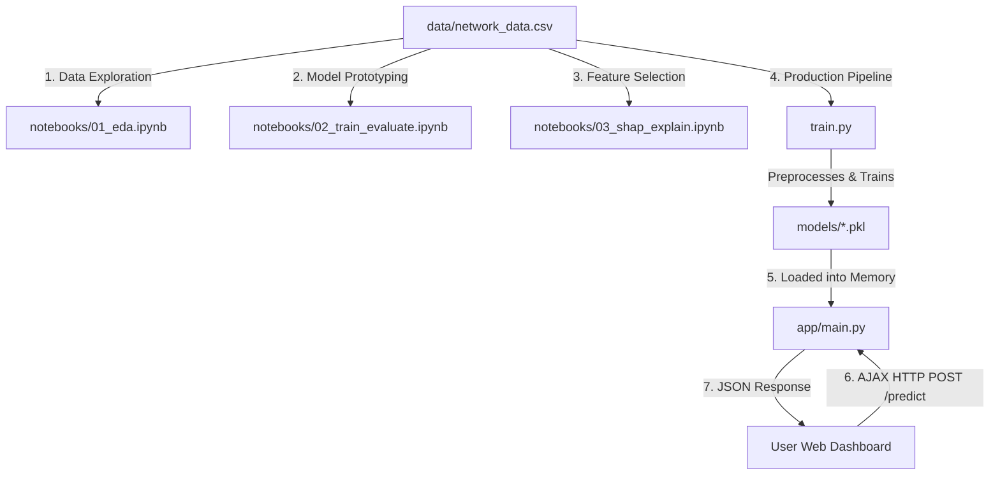

# 🔐 CyberSec IDS — Network Threat Detector

> A premium, end-to-end Machine Learning pipeline that detects malicious network traffic using **Random Forest** (supervised) and **Isolation Forest** (unsupervised) classifiers. Served via a content-negotiated **Flask REST API** with a real-time, glassmorphism **SOC Web Dashboard**.

---


## 🗺️ High-Level Architecture

Below is the chronological sequence of the data pipeline, from exploratory research to live production hosting:



---

## 🧠 Key Features

- **Hybrid Intelligence Models:** 
  - **Supervised Classifier (Random Forest):** Classifies connections into `normal` or `attack` classes with high precision.
  - **Unsupervised Anomaly Detector (Isolation Forest):** Measures structural distance to flag unusual patterns/zero-day attacks, even if they don't match known signatures.
- **Glassmorphism Web Dashboard:** An interactive Security Operations Center (SOC) style dashboard featuring:
  - **Dynamic Preset Cards:** Instant buttons to auto-populate features for typical traffic types (*Normal Web*, *DDoS*, *Port Scanning*, *Ping of Death*).
  - **Real-Time AJAX Communication:** Submits data and updates UI outputs without full-page reloads.
  - **Visual Gauges:** Glowing radial confidence meters, anomaly scoring indicators, and alert banners.
- **Content Negotiation:** The root URL (`/`) returns a clean JSON metadata response for automation scripts (e.g. `curl`) and serves the interactive dashboard for web browsers.

---

## 🛠️ Technological Stack

- **Core & Web Logic:** Python, Flask, Gunicorn (production server), Jinja2 templates.
- **Machine Learning & Math:** Scikit-Learn, Pandas, NumPy, Joblib, SHAP (explainable AI).
- **User Interface:** jQuery, HTML5, Custom Vanilla CSS (Glassmorphism design system), Outfit & Plus Jakarta Sans Google Fonts, FontAwesome Icons.

---

## 🗂 Project Directory Structure

```text
network-threat-detector/
├── data/
│   └── network_data.csv          # NSL-KDD-style connection dataset
├── notebooks/
│   ├── 01_eda.ipynb              # Exploratory Data Analysis
│   ├── 02_train_evaluate.ipynb   # Model prototyping & evaluation
│   └── 03_shap_explain.ipynb     # SHAP model explainability
├── app/
│   ├── templates/
│   │   └── index.html            # SOC Dashboard UI
│   └── main.py                   # Flask API & Routing
├── models/
│   ├── rf_model.pkl              # Saved Random Forest Classifier
│   ├── iso_model.pkl             # Saved Isolation Forest
│   ├── scaler.pkl                # Saved StandardScaler
│   ├── label_encoder.pkl         # Saved Categorical Encoder
│   └── features.pkl              # Saved Feature Order List
├── train.py                      # Training & Serialization pipeline
├── requirements.txt              # Project packages list
└── README.md                     # Main documentation
```

---

## 🚀 Quick Start (Local Run)

### 1. Installation

Clone this repository and install dependencies inside a virtual environment:

```bash
# Clone the repository
https://github.com/DhruviKava/CyberSec.git
cd CyberSec

# Create and activate virtual environment
python3 -m venv netdet
source netdet/bin/activate

# Install dependencies
pip install -r requirements.txt
```

### 2. Run the Training Pipeline

If you want to train the models from scratch on the raw dataset:

```bash
python train.py
```
This updates the binaries in the `models/` directory.

### 3. Run the Server

Start the Flask server:

```bash
python app/main.py
```
* **Interactive UI:** Navigate to `http://localhost:5000` in your web browser.
* **REST API:** Automated clients can call endpoints directly.

---

## 📡 REST API Endpoints

### `POST /predict`
Submits raw connection metrics to the pipeline for classification.

**Request Payload:**
```json
{
  "duration": 0.05,
  "protocol_type": "icmp",
  "src_bytes": 65500,
  "dst_bytes": 0,
  "count": 300,
  "srv_count": 1,
  "same_srv_rate": 0.05,
  "diff_srv_rate": 0.95,
  "dst_host_count": 255,
  "dst_host_srv_count": 2
}
```

**cURL Command Example:**
```bash
curl -X POST http://localhost:5000/predict \
  -H "Content-Type: application/json" \
  -d '{"duration": 0.05, "protocol_type": "icmp", "src_bytes": 65500, "dst_bytes": 0, "count": 300, "srv_count": 1, "same_srv_rate": 0.05, "diff_srv_rate": 0.95, "dst_host_count": 255, "dst_host_srv_count": 2}'
```

**JSON Response Output:**
```json
{
  "prediction": "attack",
  "confidence": 98.0,
  "attack_probability": 98.0,
  "anomaly_detected": true,
  "anomaly_score": -0.1873,
  "models_used": ["RandomForest", "IsolationForest"]
}
```

---

